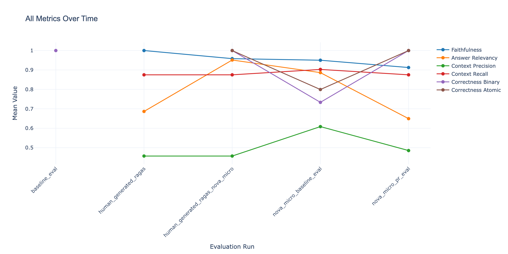
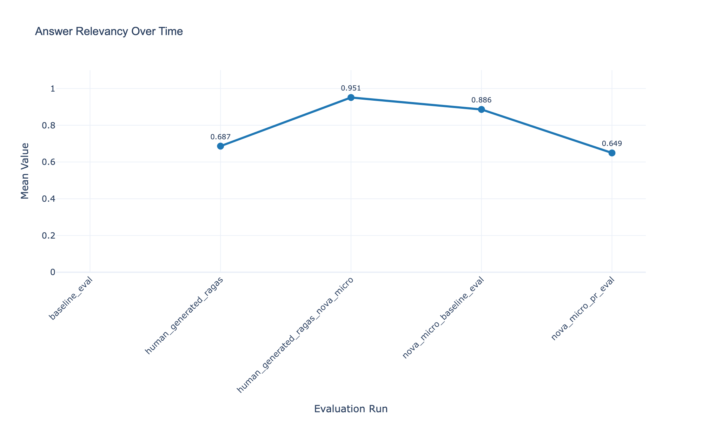
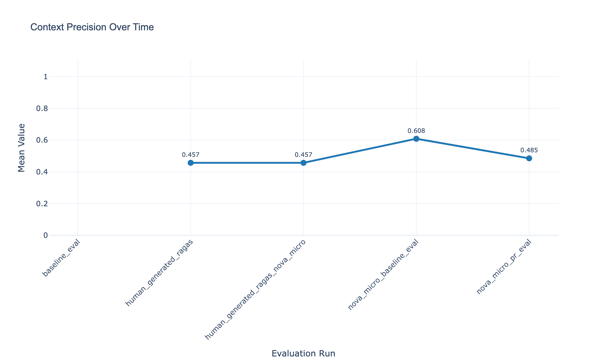
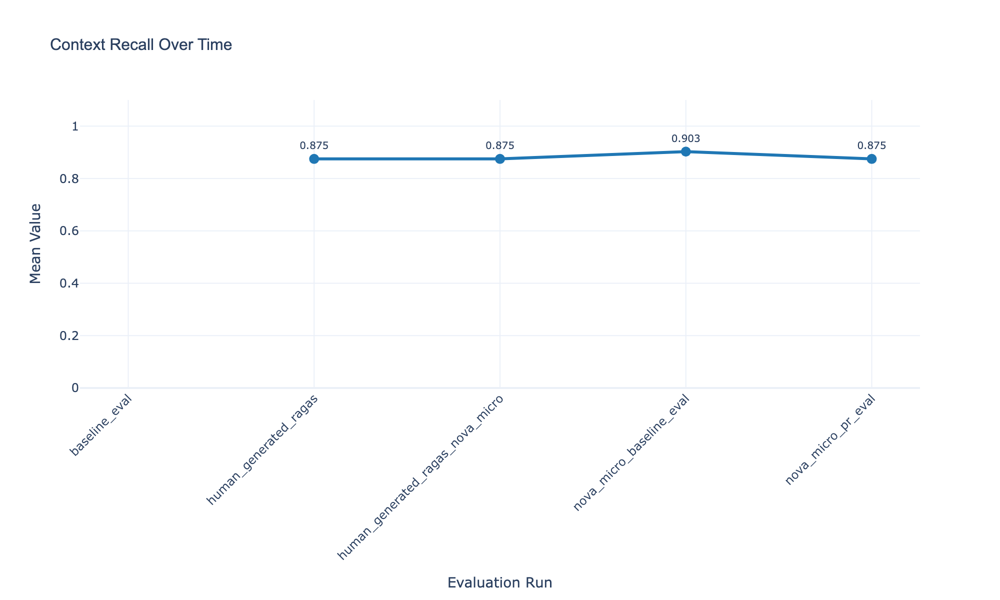
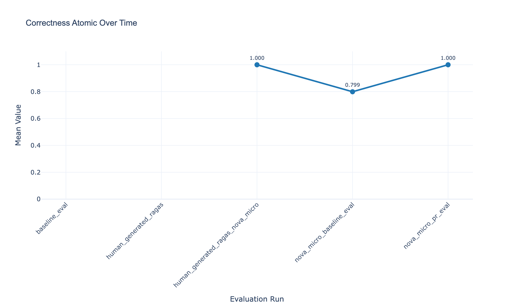
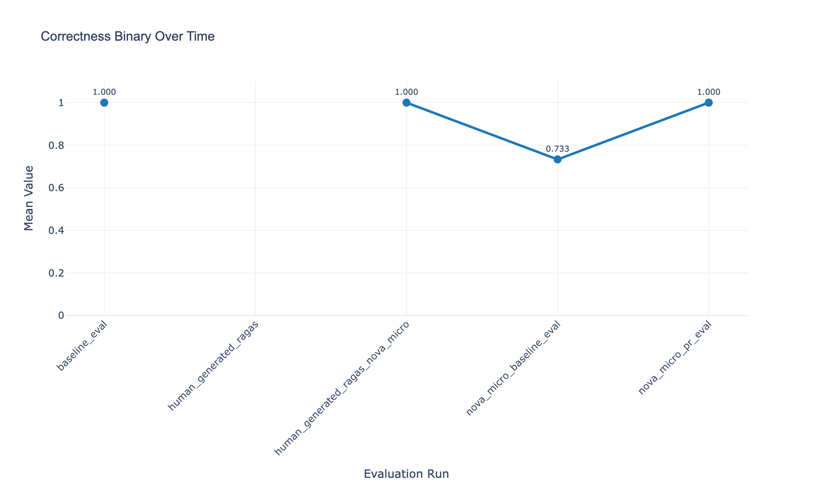
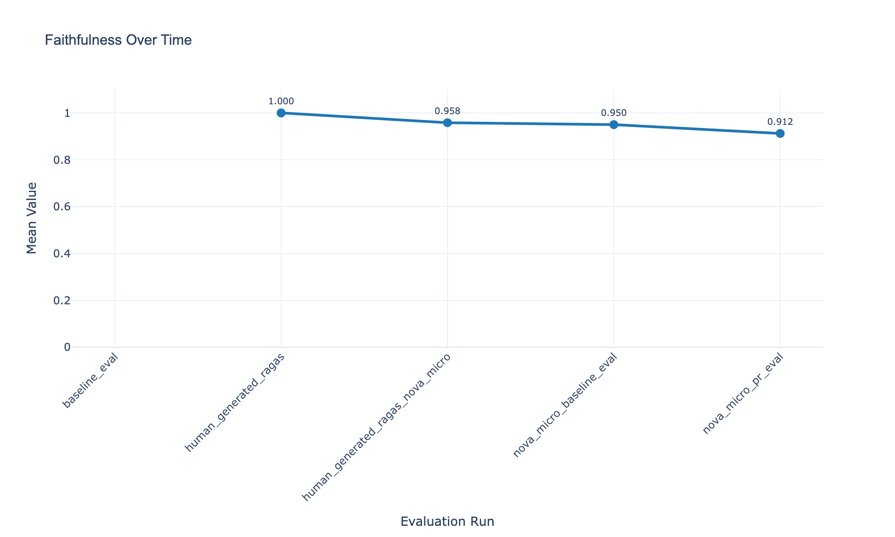

# Evaluation Results Over Time

*Generated on 2025-12-29 08:15:07*

## Evaluations Summary

| Run Name | Mode | Timestamp |
|----------|------|-----------|
| baseline_eval | local | 2025-11-26T08:47:14.215078 |
| human_generated_ragas | local | 2025-11-29T06:56:28.965984 |
| human_generated_ragas_nova_micro | local | 2025-11-30T08:44:36.761378 |
| nova_micro_baseline_eval | local | 2025-12-06T17:36:32.415911 |
| nova_micro_pr_eval | lambda | 2025-12-13T10:14:23.384700 |

## Evaluation Metric Details

### Answer Relevancy

| Run Name | Answer Relevancy |
|----------|--------------------------|
| baseline_eval | N/A |
| human_generated_ragas | 0.6866 |
| human_generated_ragas_nova_micro | 0.9512 |
| nova_micro_baseline_eval | 0.8863 |
| nova_micro_pr_eval | 0.6494 |

### Context Precision

| Run Name | Context Precision |
|----------|---------------------------|
| baseline_eval | N/A |
| human_generated_ragas | 0.4569 |
| human_generated_ragas_nova_micro | 0.4569 |
| nova_micro_baseline_eval | 0.6084 |
| nova_micro_pr_eval | 0.4851 |

### Context Recall

| Run Name | Context Recall |
|----------|------------------------|
| baseline_eval | N/A |
| human_generated_ragas | 0.8750 |
| human_generated_ragas_nova_micro | 0.8750 |
| nova_micro_baseline_eval | 0.9028 |
| nova_micro_pr_eval | 0.8750 |

### Correctness Atomic

| Run Name | Correctness Atomic |
|----------|----------------------------|
| baseline_eval | N/A |
| human_generated_ragas | N/A |
| human_generated_ragas_nova_micro | 1.0000 |
| nova_micro_baseline_eval | 0.7993 |
| nova_micro_pr_eval | 1.0000 |

### Correctness Binary

| Run Name | Correctness Binary |
|----------|----------------------------|
| baseline_eval | 1.0000 |
| human_generated_ragas | N/A |
| human_generated_ragas_nova_micro | 1.0000 |
| nova_micro_baseline_eval | 0.7333 |
| nova_micro_pr_eval | 1.0000 |

### Faithfulness

| Run Name | Faithfulness |
|----------|----------------------|
| baseline_eval | N/A |
| human_generated_ragas | 1.0000 |
| human_generated_ragas_nova_micro | 0.9583 |
| nova_micro_baseline_eval | 0.9502 |
| nova_micro_pr_eval | 0.9125 |

