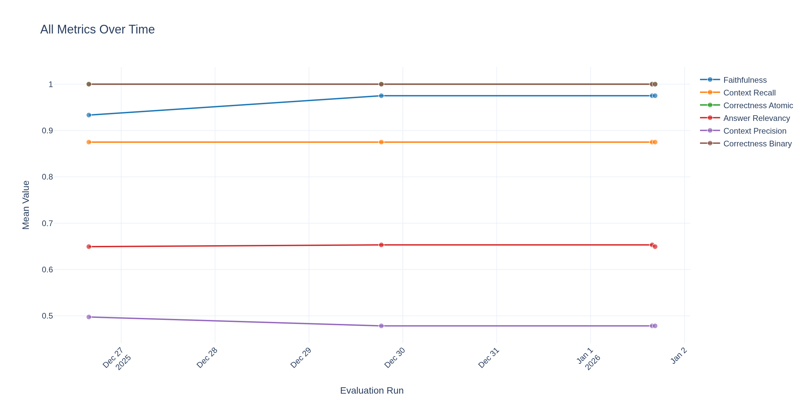
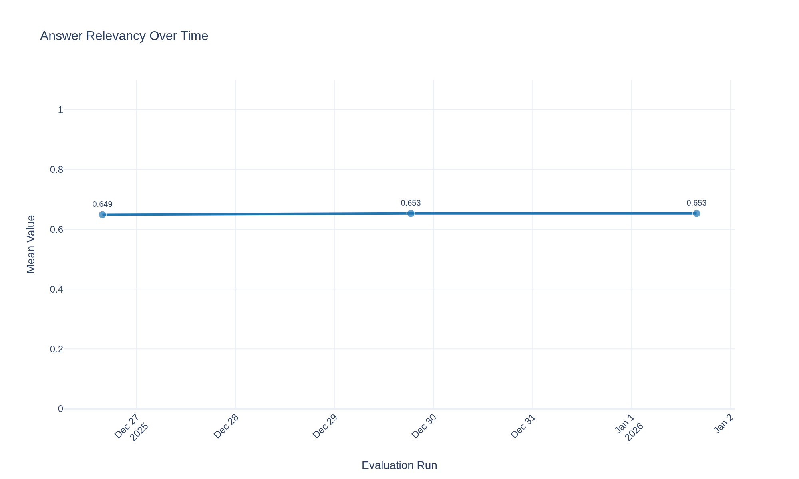
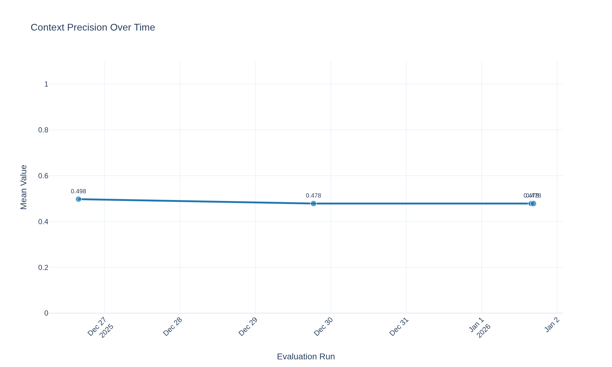
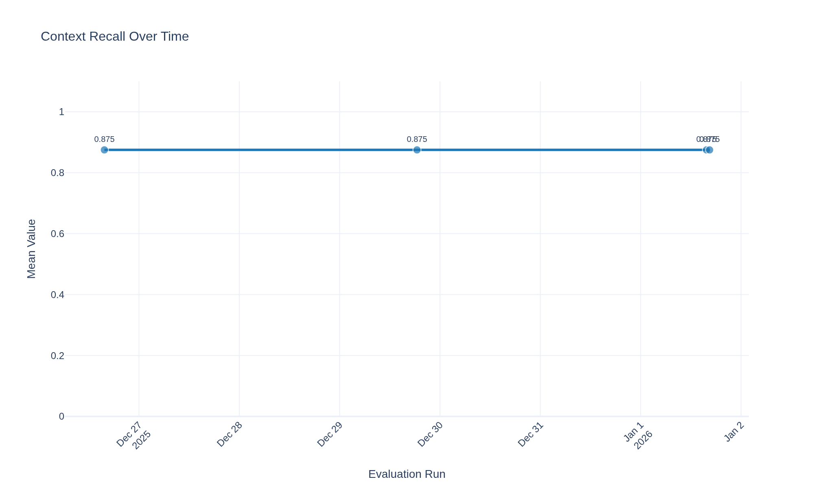
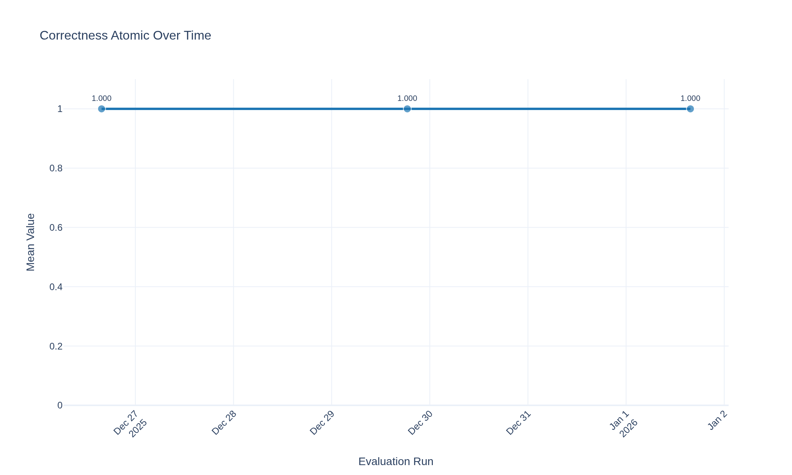
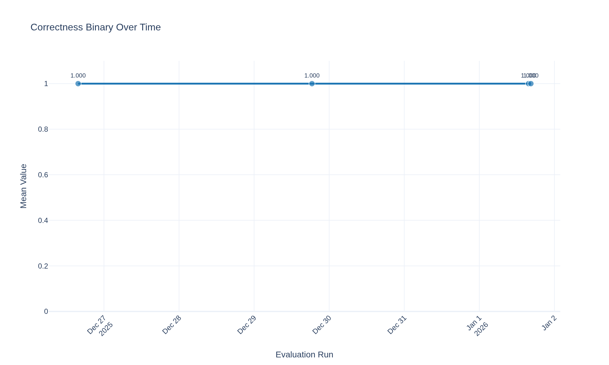
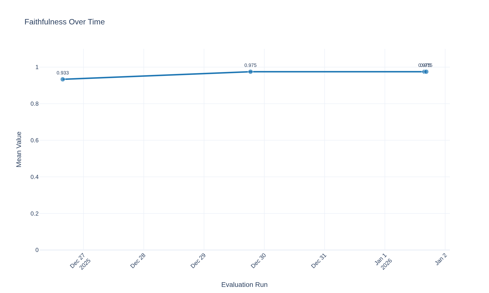

# Evaluation Results Over Time

*Generated on 2026-01-01 16:31:33*

## Evaluations Summary

| Run Name | Mode | Timestamp | Num Questions | Notes |
|----------|------|-----------|--------------|-------|
| nova_micro_pr_eval | lambda | 2025-12-26T15:44:48+00:00 |  |  |
| nova_micro_pr_eval | lambda | 2025-12-29T18:30:48.976776 |  |  |
| nova_micro_pr_eval | lambda | 2026-01-01T15:44:57.864303 |  |  |
| nova_micro_pr_eval | lambda | 2026-01-01T16:29:24.305817 |  |  |

## Evaluation Metric Details

### Answer Relevancy

| Run Name | Timestamp | Answer Relevancy |
|----------|-----------|--------------------------|
| nova_micro_pr_eval | 2025-12-26 15:44 | 0.6494 |
| nova_micro_pr_eval | 2025-12-29 18:30 | 0.6532 |
| nova_micro_pr_eval | 2026-01-01 15:44 | 0.6532 |
| nova_micro_pr_eval | 2026-01-01 16:29 | 0.6494 |

### Context Precision

| Run Name | Timestamp | Context Precision |
|----------|-----------|---------------------------|
| nova_micro_pr_eval | 2025-12-26 15:44 | 0.4977 |
| nova_micro_pr_eval | 2025-12-29 18:30 | 0.4784 |
| nova_micro_pr_eval | 2026-01-01 15:44 | 0.4784 |
| nova_micro_pr_eval | 2026-01-01 16:29 | 0.4784 |

### Context Recall

| Run Name | Timestamp | Context Recall |
|----------|-----------|------------------------|
| nova_micro_pr_eval | 2025-12-26 15:44 | 0.8750 |
| nova_micro_pr_eval | 2025-12-29 18:30 | 0.8750 |
| nova_micro_pr_eval | 2026-01-01 15:44 | 0.8750 |
| nova_micro_pr_eval | 2026-01-01 16:29 | 0.8750 |

### Correctness Atomic

| Run Name | Timestamp | Correctness Atomic |
|----------|-----------|----------------------------|
| nova_micro_pr_eval | 2025-12-26 15:44 | 1.0000 |
| nova_micro_pr_eval | 2025-12-29 18:30 | 1.0000 |
| nova_micro_pr_eval | 2026-01-01 15:44 | 1.0000 |
| nova_micro_pr_eval | 2026-01-01 16:29 | 1.0000 |

### Correctness Binary

| Run Name | Timestamp | Correctness Binary |
|----------|-----------|----------------------------|
| nova_micro_pr_eval | 2025-12-26 15:44 | 1.0000 |
| nova_micro_pr_eval | 2025-12-29 18:30 | 1.0000 |
| nova_micro_pr_eval | 2026-01-01 15:44 | 1.0000 |
| nova_micro_pr_eval | 2026-01-01 16:29 | 1.0000 |

### Faithfulness

| Run Name | Timestamp | Faithfulness |
|----------|-----------|----------------------|
| nova_micro_pr_eval | 2025-12-26 15:44 | 0.9333 |
| nova_micro_pr_eval | 2025-12-29 18:30 | 0.9750 |
| nova_micro_pr_eval | 2026-01-01 15:44 | 0.9750 |
| nova_micro_pr_eval | 2026-01-01 16:29 | 0.9750 |

